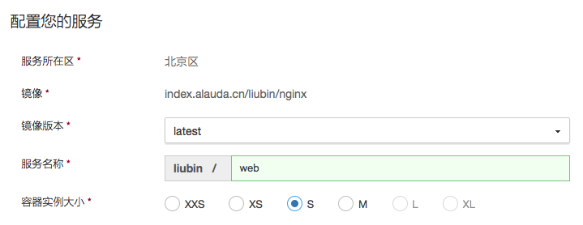

灵雀云非80端口自动反向代理
=========================

# 为啥要做这个

有的应用，比如Redmine，标准镜像只能expose 3000端口，这样我们不能固定端口访问服务，也就不能绑定自己的域名。

所以需要使用类似Nginx这样的反向代理来创建一个标准的Web 80服务。

# 使用方式

首先创建Redmine服务，记下域名和端口

其次，创建nginx服务，镜像选择liubin/nginx

设置两个变量即可：

- ALAUDA_HOST: 掐面Redmine服务的域名
- ALAUDA_PORT: 前面Redmine服务的端口号

之后，访问新创建的nginx服务即可，由于是80端口，也可以进行CNAME绑定了。

# 地址

https://hub.alauda.cn/repos/liubin/nginx

